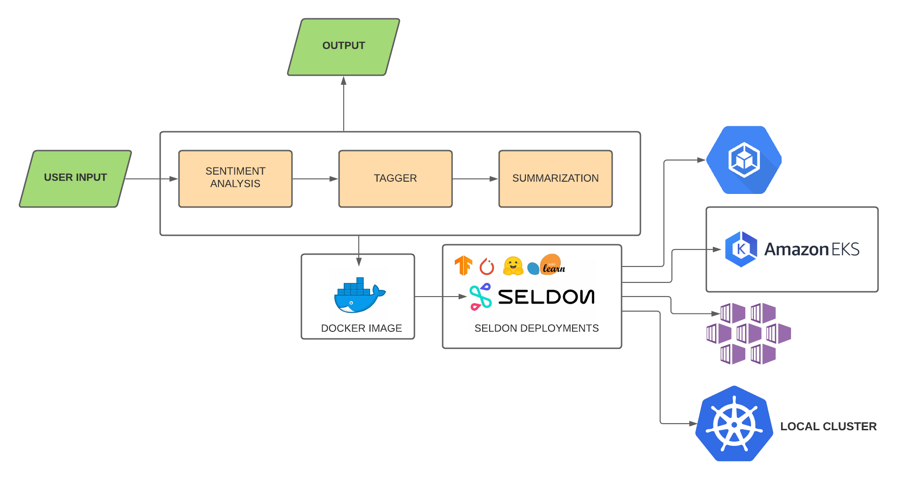
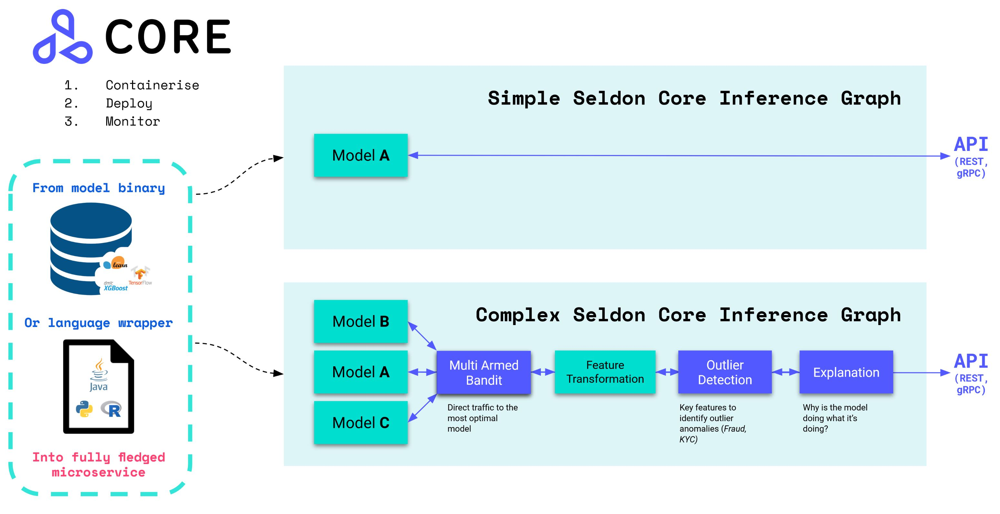

# Deploying NLP Models Using Seldon-Core on Kuberenetes 🚢

This project involves the building of a basic email microservice, The task of this microservice is to use a combination of NLP models such as Sentiment-Analysis(Model A),Tagging(Model B), 
Text Summarization(Model C), to make email service smarter.This project was build using end to end deployment on Kubernetes cluster on local enviorment using Seldon Core REST service and Seldon Deployment's.

## Architecture

This is a Project Architecture leveraging Seldon Deployments on Kubernetes.

<p align="center">
  
</p>

The Basic Seldon Inference Graph is shown below:

<p align="center">
  
</p>

## How to Setup ⚙️ :

1. Clone this Repo : `git clone https://github.com/DARK-art108/Seldon-Core-Kubernetes-Serving.git`
2. Launch your Kubernetes Cluster [Local Enviroment]
3. Install [Seldon Core using Helm](https://docs.seldon.io/projects/seldon-core/en/latest/workflow/install.html) 
4. Run : `kubectl apply -f deploy.json` or `kubectl apply -f seldon.yaml`
5. Test the microservice using CURL command given in sample-request.txt.

### You need to Create your own docker images of particuler model,if docker has not able to find mine.Instructions are given in each model folder.
1. Install `s2i cli [Source to Image by Red Hat]`

## Seldon Inference Graph [Seldon.yaml]

```

{
    "apiVersion": "machinelearning.seldon.io/v1alpha2",
    "kind": "SeldonDeployment",
    "metadata": {
        "labels": {
            "app": "seldon"
        },
        "name": "seldon-pipeline"
    },
    "spec": {
        "annotations": {
            "project_name": "seldon-pipeline",
            "deployment_version": "0.1.0",
            "seldon.io/rest-read-timeout": "100000",
            "seldon.io/rest-connection-timeout": "100000",
            "seldon.io/grpc-read-timeout": "100000"
        },
        "name": "seldon-pipeline",
        "oauth_key": "oauth-key",
        "oauth_secret": "oauth-secret",
        "predictors": [{
            "componentSpecs": [{
                "spec": {
                    "containers": [{
                            "name": "sentiment-analysis",
                            "image": "ritesh2000/sentiment-analysis:0.1.0",
                            "imagePullPolicy": "Always"
                        },
                        {
                            "name": "text-tagging",
                            "image": "ritesh2000/text-tagging:0.1.0",
                            "imagePullPolicy": "Always"
                        },
                        {
                            "name": "summarize-text",
                            "image": "ritesh2000/summarize-text:0.1.0",
                            "imagePullPolicy": "Always"
                        }
                    ],
                    "terminationGracePeriodSeconds": 20
                }
            }],
            "graph": {
                "children": [{
                    "name": "text-tagging",
                    "endpoint": {
                        "type": "REST"
                    },
                    "type": "MODEL",
                    "children": [{
                        "name": "summarize-text",
                        "endpoint": {
                            "type": "REST"
                        },
                        "type": "MODEL",
                        "children": []
                    }]
                }],
                "name": "sentiment-analysis",
                "endpoint": {
                    "type": "REST"
                },
                "type": "MODEL"
            },
            "name": "example",
            "replicas": 1,
            "annotations": {
                "predictor_version": "v1"
            }
        }]
    }
}

```


